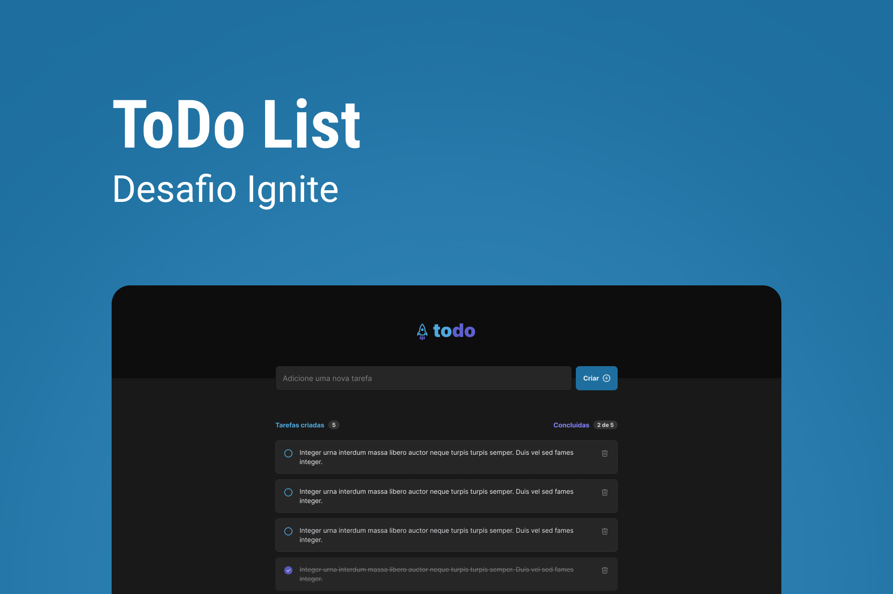

<h1 align="center">
Desafio 1 - ToDo Ignite (Em Construcao)
</h1>

  

  

  

  

---

# Introdução

Faala dev!

Seja muito bem-vindo ou bem-vinda ao primeiro desafio da trilha de **ReactJS** do **Ignite**. 

Nesse desafio você vai reforçar os **conceitos mais importantes** do ReactJS e aprender ainda mais conceitos que serão utilizados em todas as aplicações que você for desenvolver no futuro.

Como se trata de um desafio, ele necessita de alguns conhecimentos além dos abordados nesse módulo, então é importante que tenha autonomia para que consiga pesquisar essas coisas caso não saiba como resolver. Por isso, lembre-se, t**enha calma** e **acredite no seu processo.** O aprendizado daqui é muito importante, mas você com certeza vai conseguir sair daqui com muito conhecimento bacana💜

# Sobre o desafio

Nesse desafio, você vai desenvolver uma aplicação de controle de tarefas no estilo **to-do list**, que contém as seguintes funcionalidades:

- Adicionar uma nova tarefa
- Marcar e desmarcar uma tarefa como concluída
- Remover uma tarefa da listagem
- Mostrar o progresso de conclusão das tarefas

Apesar de serem poucas funcionalidades, você vai precisar relembrar conceitos como:

- Estados
- Imutabilidade do estado
- Listas e chaves no ReactJS
- Propriedades
- Componentização

Caso você queira relembrar esses conceitos, você pode assistir aulas como [Estado](https://app.rocketseat.com.br/node/chapter-i-6/group/os-motores-do-react/lesson/estado-1), [Iterando no JSX](https://app.rocketseat.com.br/node/chapter-i-6/group/os-motores-do-react/lesson/iterando-no-jsx), [Entendendo a key](https://app.rocketseat.com.br/node/chapter-i-6/group/os-motores-do-react/lesson/entendendo-a-key), [Componentes](https://app.rocketseat.com.br/node/chapter-i-6/group/iniciando-com-react/lesson/componentes-1) e [Propriedades](https://app.rocketseat.com.br/node/chapter-i-6/group/iniciando-com-react/lesson/propriedades-3).

Para completar esse desafio, você pode necessitar de pesquisas para aprender sobre métodos de manipulação de arrays como `map`, `filter`  ou até mesmo `reduce`. 

Caso queira se aprofundar ainda mais em conceitos do React, recomendamos ler a nova documentação beta do React, que explica profundamente sobre conceitos do React e como pensar no design de aplicações React. 

[Thinking in React](https://beta.reactjs.org/learn/thinking-in-react)

# Layout da aplicação

Para essa aplicação nós fornecemos um layout para que você possa seguir e implementar todas as funcionalidades desenhadas no figma. 

Para acessar o Figma, você primeiro deve criar uma conta na plataforma.

### Criando uma conta no Figma

Para acessar o Layout da aplicação, você primeiramente deve ter uma conta criada na plataforma do Figma, para isso, você pode [clicar aqui](https://www.figma.com/signup). 

Então, na página de cadastro, você pode logar diretamente com sua conta do Google ou criar uma conta com o e-mail que você preferir.

### Acessando o layout do app

Após criar e logar em sua conta, você deve duplicar o Layout do desafio. Para isso, basta você clicar no link abaixo. Ele adicionará o Layout à sua dashboard do Figma automaticamente, como uma cópia e abrirá o layout da aplicação para a sua visualização.

[ToDo List](https://www.figma.com/file/0n0zDN7zbzhRbaEO74Xesx/ToDo-List/duplicate)

# Desenvolvendo o projeto

Para desenvolver esse projeto, recomendamos utilizar as principais ferramentas que utilizamos durante o desenvolvimento do primeiro módulo do Ignite. 

Caso você precise, você pode assistir a aula [Criando um projeto React](https://app.rocketseat.com.br/node/chapter-i-6/group/iniciando-com-react/lesson/criando-um-projeto-react) para relembrar como se inicia um projeto com Vite. Mas para que você já pratique também TypeScript, você pode relembrar como iniciar um projeto Vite com TypeScript na aula [TypeScript no React](https://app.rocketseat.com.br/node/chapter-i-6/group/aprimorando-a-aplicacao/lesson/type-script-no-react). 

Caso você tenha alguma dificuldade você pode ir no nosso **[fórum](https://app.rocketseat.com.br/h/forum/react-js)** e deixar sua dúvida por lá! 

Após terminar o desafio, caso você queira, você pode tentar dar o próximo passo e deixar a aplicação com a sua cara. Tente mudar o layout, cores, ou até adicionar novas funcionalidades para ir além 🚀 

Abaixo você também pode assistir um vídeo que gravamos para fazer um onboarding no fluxo da aplicação e dar várias dicas para desenvolver as funcionalidades e o layout: 

[https://www.youtube.com/watch?v=9La-Sj-c1ns](https://www.youtube.com/watch?v=9La-Sj-c1ns)